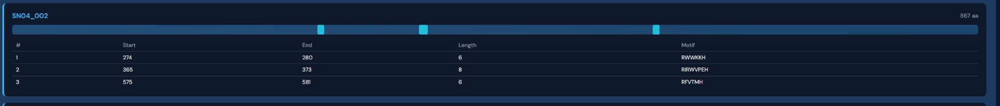

# Senary Bio

> **Computational Discovery Platform for Novel Type VI CRISPR Enzyme Therapeutics**

---

<p align="center">
  <marquee behavior="scroll" direction="left" scrollamount="4" style="background: linear-gradient(90deg, #0d1117 0%, #161b22 50%, #0d1117 100%); padding: 10px 0; border-radius: 4px; font-family: monospace; font-size: 14px;">
    <strong>Python 3.8+</strong> · <strong>BioPython</strong> · <strong>Pandas</strong> · <strong>NumPy</strong> · <strong>h5py</strong> · <strong>ARCHS4</strong> · <strong>NCBI Entrez</strong> · <strong>ESM-2</strong> · <strong>Transformers</strong> · <strong>PyTorch</strong> · <strong>OmegaFold</strong> · <strong>Google Gemini</strong> · <strong>JupyterLab</strong> · <strong>SQLite</strong> · <strong>Ollama/Llama</strong> · <strong>ChimerDB</strong> · <strong>TCGA</strong>
  </marquee>
</p>

---

## Table of Contents

1. [Mission](#-mission)
2. [Platform Overview](#-platform-overview)
3. [Structure Pipeline & Dashboard](#-structure-pipeline--dashboard)
4. [Enzyme Mining (The Armory)](#-piece-1-enzyme-mining-the-armory)
5. [Target Discovery (The Vault)](#-piece-2-target-discovery-the-vault)
6. [Matchmaker](#-piece-3-matchmaker)
7. [Expert Agent](#-piece-4-expert-agent)
8. [Technology Stack](#%EF%B8%8F-technology-stack)
9. [Quick Start & Workflow](#-quick-start--workflow)
10. [Project Structure](#-project-structure)
11. [Configuration](#%EF%B8%8F-configuration)

---

## 🎯 Mission

**Senary Bio** is pioneering the development of precision cancer therapeutics through novel Type VI CRISPR enzyme discovery. Our mission is to identify and validate high-collateral novel Type VI CRISPR enzyme variants capable of targeting cancer-specific fusion RNAs, creating a "suicide switch" mechanism that induces apoptosis specifically in tumor cells while preserving healthy tissue.

We combine computational biology, machine learning, and high-throughput screening to accelerate the discovery of next-generation RNA-guided therapeutics.

---

## 🏗️ Platform Overview

See **[FILTERING_MAP.md](FILTERING_MAP.md)** for the full filtering map from NCBI scraping → enzyme filters → target filters → matchmaker → expert agent → final novel Type VI CRISPR enzyme candidates.

**Discovery process (high level):**

1. **Mine** – SRA/WGS in obscure environments; 6-frame translate; keep only **full-enzyme** ORFs (N-term M, C-term tail, not truncated) and, when enabled, loci with **CRISPR repeats** (saved in metadata for synthesis).
2. **Design** – Embed pool (ESM-2), optional interpolate, mutate for drift (stability + &lt;85% identity).
3. **Structure filter** – OmegaFold → bi-lobed/HEPN check → keep only structure-passed sequences.
4. **Identity filter** – Keep only sequences &lt;85% identical to known Cas13 (drift goal).
5. **Matchmaker → Expert Agent** – Enzyme × fusion targets → ARCHS4 + Gemini → final leads.

```
┌─────────────────────────────────────────────┐   ┌─────────────────────────────────────────────┐
│         THE ARMORY (Enzyme Mining)           │   │        THE VAULT (Target Discovery)         │
│  sra_scout · autonomous_prospector · full_orf_checks │   │  fusion_metadata · specificity_filter · archs4 │
│  full_orf_checks · CRISPR repeat metadata   │   │                                             │
└──────────────────────┬──────────────────────┘   └──────────────────────┬──────────────────────┘
                       └────────────────────┬─────────────────────────────┘
                                            ▼
┌───────────────────────────────────────────────────────────────────────────────────────────────────┐
│  FULL PIPELINE (optional):  embed_pool → mutate_for_drift → structure_filter → identity_filter     │
│  run_full_pipeline.py  →  data/identity_filtered/passed.fasta  →  MATCHMAKER  →  EXPERT AGENT    │
└───────────────────────────────────────────────────────────────────────────────────────────────────┘
                                            ▼
                               ┌────────────────────────┐
                               │   MATCHMAKER           │  →  EXPERT AGENT  →  lead_candidates_filtered.csv
                               │   Enzyme × Fusion      │
                               └────────────────────────┘
```

---

## 🔬 Structure Pipeline & Dashboard

For 2–3 HEPN filtered enzymes, the structure pipeline predicts 3D conformations with **OmegaFold**, computes TM-score homology vs known Type VI CRISPR structural references, and builds an interactive dashboard with domain coloring and motif tables.



*Example: Protein SN04_002 (867 aa) with HEPN motifs highlighted on the sequence bar and detailed motif table (position, length, sequence).*

OmegaFold-predicted structures in the dashboard are colored by **Pfam domain** (when InterPro annotations are available). The 3D viewer uses the same color scheme:


| Color | Domain | Pfam | Meaning |
|-------|--------|------|---------|
| **Cyan** | HEPN | PF05168 | Higher Eukaryotes and Prokaryotes Nucleotide-binding domain; the **nuclease** that cleaves RNA (RxxxxH motif). Cas13 has 2–3 HEPN domains. |
| **Orange** | HEL | PF01228 | Helicase-like domain; often involved in crRNA binding and target recognition. |
| **Slate gray** | WYL | PF18456 | WYL-domain (effector-associated); found in some Type VI systems. |
| *Spectrum* | — | — | Regions without a mapped Pfam domain are shown in a rainbow gradient by position along the chain. |

Run InterProScan on your 2–3 HEPN FASTA and pass the resulting `domains.json` to the structure dashboard to see domain-colored 3D structures; otherwise the viewer shows the full chain in spectrum coloring.

### What the Dashboard Shows

| Feature | Description |
|--------|-------------|
| **Protein ID & length** | Identifier (e.g. `SN04_002`) and total amino acids |
| **Sequence bar** | Linear map of the protein with domain/motif regions highlighted in cyan |
| **Motif table** | Start, End, Length, and sequence for each identified HEPN motif |
| **3D viewer** | Interactive OmegaFold structure (3Dmol.js) with domain coloring as in the table above |

### Pipeline Commands

```bash
# 1. Filter to 2-3 HEPN sequences
python visualization/filter_23_hepn.py

# 2. Run OmegaFold (PyTorch; works on RunPod, local GPU)
python visualization/run_omegafold.py --omegafold-repo /path/to/OmegaFold

# 3. Compute TM-score vs Type VI CRISPR structural references
python visualization/run_tmscore.py

# 4. Generate dashboard
python visualization/structure_dashboard.py

# 5. Serve and view
python -m http.server 8000
# Open: http://localhost:8000/visualization/structure_dashboard.html
```

**OmegaFold setup (Python 3.11/3.12):** OmegaFold is not on PyPI and supports Python 3.8–3.10 only. On RunPod or newer Python:

```bash
git clone https://github.com/HeliXonProtein/OmegaFold.git
cd OmegaFold && pip install torch biopython
```

Then use `--omegafold-repo /path/to/OmegaFold` or `OMEGAFOLD_REPO`. Output: `data/structure_pipeline/structures/omegafold/`.

---

## 📦 Piece 1: Enzyme Mining (The Armory)

| Module | Purpose | Logic |
|--------|---------|-------|
| **sra_scout** | Unannotated metagenomes (WGS) | Normalizes query, tries `wgs[Prop]` → fallback; 6-frame translate, HEPN + topology; **full_orf_checks** (N-term M, C-term tail, contig boundary); saves `undiscovered_typevi_*.fasta` |
| **autonomous_prospector** | AI-driven continuous mining | LLM → SRAScout.search_wgs → semantic filter → DeepEngine + NeighborhoodWatch → deep_mine ORFs 600–1400 aa; **full_orf_checks**; when REQUIRE_CRISPR/REQUIRE_FULL_STRUCTURE, requires ≥MIN_REPEAT_COUNT repeat domains; saves `deep_hits_*.fasta` + metadata |
| **full_orf_checks** | Full-enzyme ORF validation | N-term: ORF starts with M; C-term: min tail after last HEPN; contig-boundary: reject ORFs truncated within margin nt (env: REQUIRE_START_M, MIN_CTERM_TAIL, CONTIG_BOUNDARY_MARGIN) |
| **deep_miner_utils** | Deep learning engine | **DeepEngine**: ESM-2 35M; scores vs **RfxCas13d** and **PspCas13a** when `ESM_REFERENCE_FASTA` set (closest similarity); **NeighborhoodWatch**: CRISPR array detection |
| **family_grouper** | Group mined sequences by homology | ESM-2 clustering; SN01_001 naming; outputs `data/mined_sequences/family_grouped_*.fasta`, `fam_fasta.fasta` |

---

## 📦 Piece 2: Target Discovery (The Vault)

| Module | Purpose | Logic |
|--------|---------|-------|
| **fusion_metadata** | Fusion → cancers mapping | Loads `KB_and_Pub_Recur_per_cancer.csv` + novel matrix; builds `fusion → [TCGA]`; `TCGA_TO_ORGAN` maps cancer codes to ARCHS4 keywords |
| **specificity_filter** | High-specificity targets | Loads disease matrix; keeps fusions in ≤`max_tissue_types` (default 3); outputs `high_specificity_targets.csv` |
| **mutation_loader** | VCF mutation mining | Parses VCF for gene-specific mutations (e.g. KRAS G12C) |
| **archs4_loader** | Expression & safety | HDF5 human_matrix; `get_gene_expression`, `fusion_absent_in_normal_present_in_cancer`; organ-specific enrichment |

---

## 📦 Piece 3: Matchmaker

- Loads enzymes (FASTA or mock) and targets (`high_specificity_targets.csv` or `known_fusions.csv`)
- Disease map from `KB_and_Pub_Recur_per_cancer.csv` or `disease_matrix_*.csv`
- Screens enzyme × target; PFS rule (no G at 3′); outputs `lead_candidates.csv`

---

## 📦 Piece 4: Expert Agent

- Loads `lead_candidates.csv`, filters by `Associated_Disease`
- Groups by (Target_Fusion, Associated_Disease) to minimize API calls
- ARCHS4: organ-specific enrichment or global absent-in-normal
- Gemini AI verdict (GO / NO-GO / HOLD), screening strategy
- Outputs `lead_candidates_filtered.csv`

---

## 🛠️ Technology Stack

| Category | Stack |
|----------|-------|
| **Core** | Python 3.8+, BioPython, Pandas, NumPy, h5py, JupyterLab, openpyxl, python-dotenv |
| **Deep Learning** | PyTorch, Transformers (ESM-2), OmegaFold |
| **AI & Data** | Google Gemini, Ollama/Llama (optional), SQLite |
| **Data Sources** | NCBI, ARCHS4, ChimerDB, TCGA |

---

## 🚀 Quick Start & Workflow

### Prerequisites

```bash
python -m venv venv
# Windows: venv\Scripts\activate   |   macOS/Linux: source venv/bin/activate
pip install -r requirements.txt
```

For **Autonomous Prospector**: `pip install torch transformers requests`

### Data Setup

| File | Description |
|------|-------------|
| `data/targets/known_fusions.csv` | Validation targets |
| `data/targets/novel_fusions.csv` | Discovery targets |
| `data/matrices/disease_matrix_*.csv`, `KB_and_Pub_Recur_per_cancer.csv` | Fusion × cancer matrix |
| `data/expression_data/human_matrix.h5` | ARCHS4 (download from [ARCHS4](https://maayanlab.cloud/archs4/)) |
| `data/references/known_cas13.fasta` | Known Cas13 sequences (Lwa, Rfx, etc.) for identity/drift filter; see `data/references/known_cas13.fasta.example` |

Mining outputs: `data/raw_sequences/deep_hits_*.fasta` and `*_metadata.csv`. To regenerate fusion/matrix CSVs from Excel: place `Recurrent_table.xlsx` in `data/source/`, then `python utils/split_excel.py` (writes to `data/targets/` and `data/matrices/`).

### Workflow Steps

| Step | Command |
|------|---------|
| **1. Mine Enzymes** | Autonomous Prospector: `python modules/mining/autonomous_prospector.py` (full-enzyme + optional CRISPR repeat requirement; saves `data/raw_sequences/deep_hits_*.fasta` + `*_metadata.csv` with SRA + repeat domains) |
| | SRA Scout: `SRAScout().search_wgs(...)` → `fetch_and_mine` (full-enzyme ORF checks applied) |
| **2. Family Grouping** | `python modules/mining/family_grouper.py` (ESM-2 homology, SN01_001 naming) |
| **3. Specificity Filter** | `python modules/targeting/specificity_filter.py` |
| **4. Matchmaker** | `python modules/matchmaker.py` |
| **5. Expert Agent** | `python modules/analysis/expert_agent.py` (.env: GEMINI_API_KEY) |
| **6. ARCHS4 Test** | `python run_targeting.py` |
| **7. Structure Pipeline** | See [Structure Pipeline & Dashboard](#-structure-pipeline--dashboard) above |

### Full 4-Step Pipeline (Design → Structure → Identity → Matchmaker)

After mining, run the integrated pipeline on a FASTA pool (e.g. latest `deep_hits_*.fasta` or merged pool):

| Pipeline step | What it does |
|---------------|--------------|
| **Embed** | ESM-2 embeddings for all sequences → `data/design/embeddings/` |
| **Mutate for drift** | Score stability vs **RfxCas13d/PspCas13a** (`--stability-refs` or `ESM_REFERENCE_FASTA`); optional **Gemini** trans-cleavage prompt (`--use-trans-cleavage-prompt`) for mutations that maintain structure but may increase trans-cleavage; keep variants &lt;85% identity → `data/design/drift_variants.fasta` |
| **Structure filter** | OmegaFold → TM-score + HEPN check → `data/structure_pipeline/passed_structures.fasta` |
| **Identity filter** | Keep only &lt;85% identity to `data/references/known_cas13.fasta` → `data/identity_filtered/passed.fasta` |
| **Matchmaker** (optional) | Enzyme × fusion targets → `lead_candidates.csv` |

```bash
# With GPU (OmegaFold on this machine)
python run_full_pipeline.py --input data/raw_sequences/deep_hits_latest.fasta --run-matchmaker

# No GPU: skip structure filter
python run_full_pipeline.py --skip-structure --run-matchmaker

# Use latest deep_hits automatically
python run_full_pipeline.py --run-matchmaker
```

**Full enzyme & CRISPR repeats (mining):** Set `REQUIRE_START_M=1`, `MIN_CTERM_TAIL=15`, `REQUIRE_FULL_STRUCTURE=1`, `MIN_REPEAT_COUNT=1` in `.env` to keep only full-enzyme ORFs and loci with at least one CRISPR repeat saved. See [Configuration](#%EF%B8%8F-configuration) and **[docs/VPS_RUN_PLAN.md](docs/VPS_RUN_PLAN.md)**.

---

## 📂 Project Structure

```
collateral_bio_core/
├── README.md
├── FILTERING_MAP.md
├── requirements.txt
├── main.py
├── run_targeting.py
├── assets/
│   └── structure-dashboard-screenshot.png
├── data/
│   ├── raw_sequences/         # deep_hits_*.fasta, deep_hits_*_metadata.csv (SRA + repeat domains)
│   ├── mined_sequences/       # family_grouped_*.fasta
│   ├── design/                # embeddings/, drift_variants.fasta
│   ├── structure_pipeline/    # passed_structures.fasta, structures/omegafold/, references/
│   ├── identity_filtered/     # passed.fasta, identity_metadata.csv
│   ├── expression_data/       # human_matrix.h5
│   ├── source/                # Recurrent_table.xlsx (input for split_excel)
│   ├── targets/               # known_fusions.csv, novel_fusions.csv, high_specificity_targets.csv
│   ├── matrices/              # disease_matrix_*.csv, KB_and_Pub_Recur_per_cancer.csv
│   └── references/            # known_cas13.fasta, mining_refs.fasta
├── modules/
│   ├── mining/                # sra_scout, autonomous_prospector, full_orf_checks, deep_miner_utils, family_grouper
│   ├── design/                # embed_pool, interpolate, mutate_for_drift (ESM-2 latent + drift)
│   ├── structure_filter/      # predict_structures, bi_lobed_hepn_check, run_filter
│   ├── identity_filter.py     # drift goal: max identity < 85%
│   ├── targeting/             # archs4_loader, fusion_metadata, specificity_filter
│   ├── analysis/              # expert_agent
│   ├── discovery/             # fusion_caller
│   └── matchmaker.py
├── run_full_pipeline.py       # orchestration: embed → mutate → structure → identity [→ matchmaker]
├── config/
│   └── pipeline.env.example   # env vars for pipeline / VPS
├── docs/
│   └── VPS_RUN_PLAN.md        # how to run the full pipeline on a VPS
├── visualization/
│   ├── filter_23_hepn.py
│   ├── run_omegafold.py
│   ├── run_tmscore.py
│   ├── structure_dashboard.py
│   ├── structure_dashboard.html
│   └── family_dashboard.py
├── utils/                     # split_excel, inspect_archs4_metadata
├── prompts/
├── lead_candidates.csv
└── lead_candidates_filtered.csv
```

---

## ⚙️ Configuration

| Variable | Purpose |
|----------|---------|
| `GEMINI_API_KEY` | Expert agent AI |
| `TARGET_FUSIONS_CSV` | `novel_fusions.csv` for novel run |
| `NORMAL_MAX_TPM`, `CANCER_MIN_TPM` | ARCHS4 filter thresholds |
| `ENRICHMENT_FACTOR`, `USE_ORGAN_SPECIFIC` | Organ-specific ARCHS4 |
| `LLM_PROVIDER`, `LLM_LOCAL_URL`, `LLM_MODEL` | Prospector LLM (e.g. Ollama) |
| `ESM_SIMILARITY_FLOOR`, `ESM_SIMILARITY_CEILING` | Diversity mode: keep hits in [floor, ceiling] (e.g. 0.5–0.82) |
| `REQUIRE_START_M`, `MIN_CTERM_TAIL`, `CONTIG_BOUNDARY_MARGIN` | Full-enzyme ORF checks: N-term M, C-term tail after HEPN, contig-boundary margin (nt) |
| `REQUIRE_FULL_STRUCTURE`, `MIN_REPEAT_COUNT` | When 1: require CRISPR array + at least MIN_REPEAT_COUNT repeat domains saved (full locus) |
| `ESM_REFERENCE_FASTA` | FASTA with **RfxCas13d** and **PspCas13a** (or other refs) for mining and design; mining keeps **closest** similarity (leave `ESM_SIMILARITY_CEILING` unset) |
| `GEMINI_API_KEY` | Optional: for trans-cleavage mutation suggestions in `mutate_for_drift --use-trans-cleavage-prompt` |
| `OMEGAFOLD_REPO` | Path to cloned OmegaFold repo (Python 3.11/3.12) |

### Troubleshooting

- **"Enzyme file not found"** – Matchmaker falls back to mock enzymes.
- **"ARCHS4 file not found"** – Download `human_matrix.h5` into `data/expression_data/`.
- **Prospector import error** – Install `torch`, `transformers`, `requests`.
- **OmegaFold Python 3.12** – Use clone + `--omegafold-repo`.
- **No hits from mining** – Check `REQUIRE_START_M`, `MIN_CTERM_TAIL`; relax or set `REQUIRE_CRISPR=0` / `REQUIRE_FULL_STRUCTURE=0` to test.
- **Identity filter keeps all** – Add sequences to `data/references/known_cas13.fasta`; otherwise max identity is 0 and all pass.

---

## 📄 License

Proprietary – Collateral Bio © 2026

---

*Built with precision for precision medicine.*
